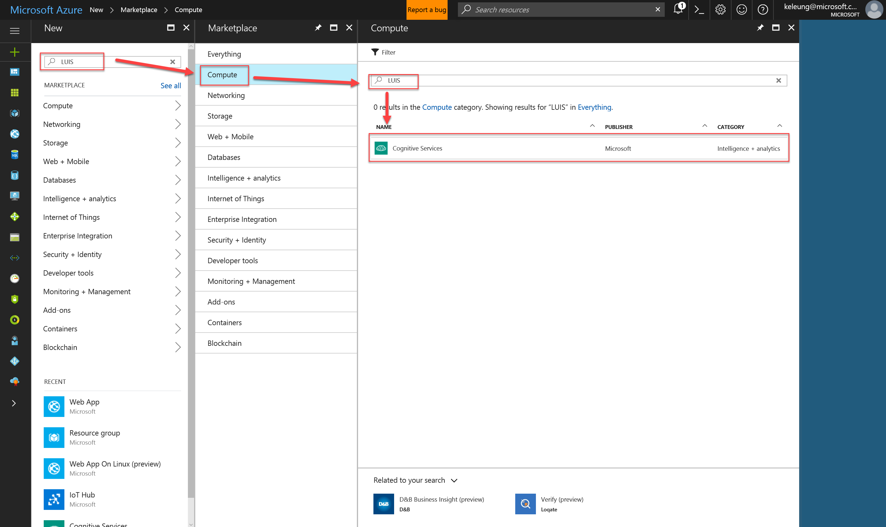
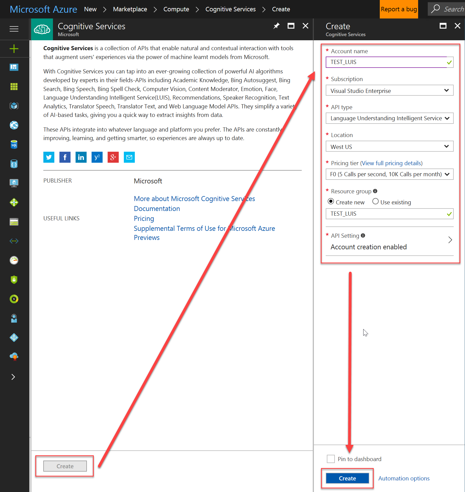
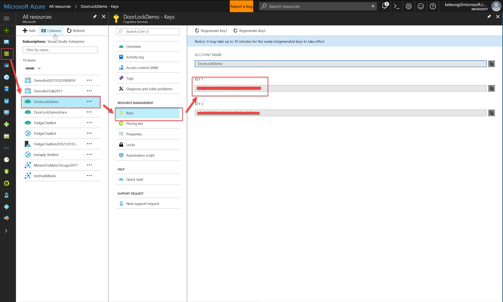
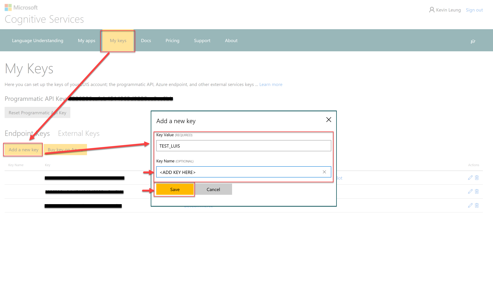

# BotScheduleDemo
Demo chat bot using Microsoft Bot Framework to view speakers at an event (with and without LUIS).

Microsoft Tech Evangelists
- Gabrielle Crevecoeur - (GitHub: gcrev93 | Twitter: @NoWaySheCodes)
- Kevin Leung (GitHub & Twitter: @KSLHacks)

### Chat bot without LUIS
See `app.js`

### Chat bot with LUIS
See `appLUIS.js`

# Building The Chat Bot -- W/O LUIS

### Prerequisites
1. You are going to need an Azure account. Sign up at [here](https://azure.microsoft.com/en-us/free/) for your free trial
2. [Node.js](https://nodejs.org/)

## Step 1: Setup on Azure
After you have created your Azure account, it is time to create a web application for the ChatBot to run on. This is where the endpoints for communication with your bot are created.

1. Go to http://portal.azure.com
2. Select ‘New’
3. Then ‘Web + mobile’
4. And finally ‘Web App’
5. Create a name for your App
6. Choose your subscription
7. Resource Group: choose Default
8. App Service Plan: choose Default
9. Click Create.

Once your Web App is created and available in the 'All Resources' menu. Go to your Web Apps Overview section and find the url! Save that url somewhere because it will come in handy later.

## Step 2: Register Your Bot
After your web app has been created, you will need to register your bot on the bot framework site.

1. Go to http://dev.framework.com/bots/new
2. Give your bot a name, a bot handle (which will be used in the web link of the bot) and the description of your bot
3. Next, you need to configure your Message Endpoint. This is the url you got from your Azure Web App. You need to be sure you use https at the beginning of the link and add /api/messages to the end of the link. i.e. https://mhackschatbotnode.azurewebsites.net/api/messages
4. Then Generate your Microsoft App Id and Password by pressing the 'Create Microsoft App ID and password.'
5. Your App ID will automatically populate and you need to save your App password somewhere separately, because it will be hidden, until you regenerate a new one.
6. Lastly, you will need to add your APP ID and APP PASSWORD to your Azure settings. Go back to your web app overview, and in the task pnnel, go down to Application Settings.
7.  Scroll down to the App settings section and fill in your APP ID ad APP PASSWORD. The Key column should state MICROSOFT_APP_ID and the value is the App ID you got from Bot registration. Same goes for the App password, except the Key is MICROSOFT_APP_PASSWORD and the value is the App Password you got from Bot registration.

## Step 3: Get coding
First create a directory! In the working directory, you will need to set up the projec as a node project and then download the proper node modules.

1. Initialize the node project `npm init`
2. Install proper node modules `npm install --save botbuilder` `npm install --save restify `
3. Create an app.js file in your directory
4. Create an another js file that will communicate with the quizlet API (in this repository, the file is called api.js)

In your app.js file you will need the following required code just to properly set up your bot:

        var restify = require('restify');
        var builder = require('botbuilder');

        //=========================================================
        // Bot Setup
        //=========================================================

        // Setup Restify Server
        var server = restify.createServer();
        server.listen(process.env.port || process.env.PORT || 3978, function () {
           console.log('%s listening to %s', server.name, server.url);
        });

        // Create chat bot
        var connector = new builder.ChatConnector({
           appId: <YOUR APP ID>,
            appPassword: <YOUR APP PASSWORD>
        });

        var bot = new builder.UniversalBot(connector);
        server.post('/api/messages', connector.listen());

This is just the bare bones of the bot. Before we add any dialogs, lets be sure your api file is set up correctly.

### Dialogs

Dialogs are used to manage the bots conversation with a user. They are called upon the same way you would call a webpage on a website, routing.
ie. '/' is the root dialog -- which is the first thing the bot will say when the user calls upon it. '/test' is a dialog named tes

The Dialog section to app.js is below:

        //=========================================================
        // Bots Dialogs
        //=========================================================

            bot.dialog('/',

                function (session) {
                  session.send('Hello GOTO Conference!')
                  session.beginDialog('/SelectDay')
                })

            bot.dialog('/SelectDay', [
              function (session) {
                builder.Prompts.choice(session, ' What day would you like to view the schedule for?', ['Monday', 'Tuesday', 'Wednesday'])
              },
              function (session, results) {
                if (results.response) {
                  day = results.response
                  session.beginDialog('/SelectTime')
                } else {
                  session.beginDialog('/SelectDay')
                }
              }
            ])

            bot.dialog('/SelectTime', [
              function (session) {
                builder.Prompts.choice(session, 'What time slot?', ['1035', '1140', '1330'])
              },
              function (session, results) {
                if (results.response) {
                  session.send('Pulling the sessions. One second')
                  RetrieveSchedule(session, results.response.entity, function (session) {
                    // display card with data
                    var msg = new builder.Message(session)
                    .textFormat(builder.TextFormat.xml)
                    .attachments([
                      new builder.ThumbnailCard(session)
                            .title(data.talk)
                            .subtitle(data.firstName + ' ' + data.lastName + ' & ' + data.cofirstName + ' ' + data.colastName + ' | ' + data.day + ' at ' + data.time)
                            .text(data.abstract)
                            .images([builder.CardImage.create(session, data.image)])
                            .tap(builder.CardAction.openUrl(session, data.link))
                    ])
                    session.send(msg)
                  })
                } else {
                  session.beginDialog('/SelectTime')
                }
              }
            ])

Looking at this code, you see that the dialog starts with the root function. Simply asking the user if they would actually run to the program. The next dialog, '/user', checks to see if the user would like to study; if they choose yes, it then checks to see if there is a hardcoded username or if we need to ask the user for one. If the username was hardcoded it will just jump to to the '/subject' dialog because the users study sets were found already in the self invoking function discussed earlier, if not it will prompt for the username, call the GetSets function with the new username and then call the '/subject' dialog. In the '/subject' dialog the user is prompted as to what study set they would like to study. Once they choose, GetTerms is called based on their decision and then the bot will go to the '/study' dialog. In the '/study' dialog, the act of looking at terms, "flipping" the card for the definition, moving to the next card and possibly exiting early is possible. We use the index variable to keep track of what card we are in for both the term and def arrays.

Lets break down some components of this dialog. 

#### Sessions
In every dialog, you see a parameter named session. The session object is passed to your dialog handlers anytime your bot receives a message from the user. The session object is the primary mechanism you’ll use to manage messages received from and sent to the user

ex:

        bot.dialog('/',

                function (session) {
                  session.send('Hello GOTO Conference!')
                  session.beginDialog('/SelectDay')
                })
        
#### Waterfalls
Waterfalls are seen in several of the dialogs seen above.Waterfalls are used to let you collect input from the user using a sequence of steps.  Many dialogs will have several functions inside of them in which one function will be called after the user. Most waterfalls work in a way such that you prompt a user for information in one function, then the answer is passed to the next function, in which you will manipulate the answer received.

ex:

        bot.dialog('/SelectDay', [
              function (session) {
                builder.Prompts.choice(session, ' What day would you like to view the schedule for?', ['Monday', 'Tuesday', 'Wednesday'])
              },
              function (session, results) {
                if (results.response) {
                  day = results.response
                  session.beginDialog('/SelectTime')
                } else {
                  session.beginDialog('/SelectDay')
                }
              }
            ])
        );
        
#### Prompts
As you noticed in the '/subject' example and other functions as well, many times users are asked for an answer, in which we need the data, there is a line that states `builder.Prompts.text()`. The bot framework has built in prompts available that can be used to collect input from a user.

Different return types of prompts available:

      builder.Prompts.text(session, "What's your name?");
      builder.Prompts.number(session, "How many do you want?");
      builder.Prompts.time(session, "When is your appointment?");
      builder.Prompts.choice(session, "Which color?", "red|green|blue");

        
#### Azure Table Storage API
We also used Azure Table Storage to store the data for the sessions. We installed the Azure Storage node module by running `npm install --save azure-storage` and input it into the code with `var azure = require('azure-storage')` along with the other node modules.

To create tables in Azure Storage follow this [documentation]('https://docs.microsoft.com/en-us/azure/storage/storage-nodejs-how-to-use-table-storage')

After you create your table via Azure Storage.. you can access it within your code. 

Within your project you need to instiate a storage object as such:

    // =========================================================
    // Azure Table Setup
    // =========================================================
    var tableSvc = azure.createTableService(<STORAGE ACCOUNT NAME>,<STORAGE ACCOUNT KEY>)
    
We used the following function retrieve information from out table using a query (The documentation above can helo you understand how queries work):

      function RetrieveSchedule (session, response, onQueryFinish, next) {
        var query = new azure.TableQuery()
          .top(1)
          .where('time eq ?', response)

        tableSvc.queryEntities('GoTo', query, null, function (error, result, response) {
          if (!error) {
            // Manipulate results into JSON object for card
            data.firstName = result.entries[0].firstName._
            data.lastName = result.entries[0].lastName._
            data.day = result.entries[0].day._
            data.time = result.entries[0].time._
            data.talk = result.entries[0].talk._
            data.link = result.entries[0].link._
            data.image = result.entries[0].image._
            data.abstract = result.entries[0].abstract._
            data.cofirstName = result.entries[0].cofirstName._
            data.colastName = result.entries[0].colastName._

            onQueryFinish(session)
          //  next()
          } else {
            console.log(error)
          }
        })
      }
      
You can see that our table has a First Name, Last Name, Day, Time, Talk , Link, Image, Abstract, Co- Speaker First Name and Co Speaker Last name column for each entry, but you can design your table to look how ever you may want it. 

        
## Step 4: Continuous Integration
If you noticed, your web app has no code to know what exactly to run. First in you code directory, create an index.html file, where you simply print "Hello World!"

        <html>
        <head>
            <title>GOTO Schedule Bot</title>
        </head>
        <body>
            Hello world! This is the Bots home page :)
        </body>	
        </html>
        
 After push your whole directory to Github! And then you will need to set up continious integration via Github in your Azure Web App. Here is a step by step on how to do so:
 
 https://azure.microsoft.com/en-us/documentation/articles/app-service-continuous-deployment/
 
## Step 5: Testing Your Bot
 
If you have a Windows Machine! You can test your bot on the Bot Emulator. You can install it here https://docs.botframework.com/en-us/tools/bot-framework-emulator/ ! You will need your APP ID and APP Password to enter it into the emulator and get to testing :)

# Adding Intelligence with LUIS
Note: You should read through and understand the steps above before implementing LUIS. There is a lot of overlap on how dialogs and conversations are created so please read!

## Step 1: Obtaining a LUIS Subscription Key
Head over to your [Azure Portal](https://portal.azure.com/) and login. If you do not have an account, you can sign up for a free trial with free azure credits added to your account. (Regardless, we will be using the free tier so LUIS will not be consuming credits).

- Click on 'Cognitive Services' and click 'Create' on the next blade that shows up.

- Fill in the required text boxes
- For API Type.. be sure to select LUIS! (in the future this is how you create other Cognitive Service Keys)
- Resource Type can be any new or existing.
- Click 'Create' on the bottom

- Open up your new Azure service (which can be found under 'All Resources')
- Select 'Key' under Resource Management and you now have access to two keys. You will only need one.

## Step 2: Building your LUIS Model
The first thing we need to do is create our Language Understanding Intelligence Service (LUIS) Model. We can do this by heading over to [luis.ai](https://www.luis.ai/). You will need a Microsoft account to login but will not have to pay for the free tier subscription.

- Navigate into 'My Keys' and follow the illistration using the key you created in step 1. You will be able to use this key when we create the model.

After we have added the key, navigate to 'My Apps' and click 'New App'. Fill in the Name, language, description and in the dropdown menu for keys, select the one we just added. Finish with 'Create'

## Step 3: Training and Publishing
We can new create the intents, entities, entity phrase lists as well as view all of our statistics on the LUIS app dashboard. The first time logging in, you will be prompted with a tutorial on how to use LUIS.

After we have trained LUIS, we are ready to test, train and publish our app.

    Note: Everytime you train your model and are satisfied, make sure to re-publish. The changes to the model will NOT take effect until you publish the model again. Don't worry.. the endpoint will not change when you re-publish.

Under the 'Publish App' options, we can see the endpoint url. This gives us all the information we need for our code. Inside the endpoint url, it will include our LUIS Model ID as well as our subscription key

https://westus.api.cognitive.microsoft.com/luis/v2.0/apps/<LUIS-MODEL-ID-HERE>?subscription-key=<LUIS-Model-KEY_Here>&timezoneOffset=0&verbose=true&q=

## Step 4: Adding LUIS into your code
Please refer to `appLUIS.js` if you need a reference.

We will need to set up the recognizer for LUIS in our bot setup with the following code

    // Setup LUIS connection
    var model = 'https://api.projectoxford.ai/luis/v1/application?id=' + process.env.LUIS_ID + '&subscription-key=' + process.env.LUIS_KEY + '&verbose=true'
    var recognizer = new builder.LuisRecognizer(model)
    var dialog = new builder.IntentDialog({recognizers: [recognizer]})
    bot.dialog('/', dialog)

You will notice `var model` holds our LUIS endpoint with our model and key. You can either hardcode these values are put them in environmental variables like I have done in this project to hide the keys from prying eyes!

The last step is to set up the code to run when LUIS returns with the specific intent based on our model:

    dialog.matches('Greeting', [
      function (session, results) {
        session.send('Hello GOTO Conference! Can I help find a session for you?')
      }
    ])

`bot.dialog('/', dialog)` ensures that anything the user responds, it will hit the 'root' dialog. We then have `dialog.mathes()` which will check for the LUIS intent passed back.. in this case we define the 'Greeting' intent.

    Important: The string in `dialog.matches()` is case sensitive and must match the LUIS model intent exactly.